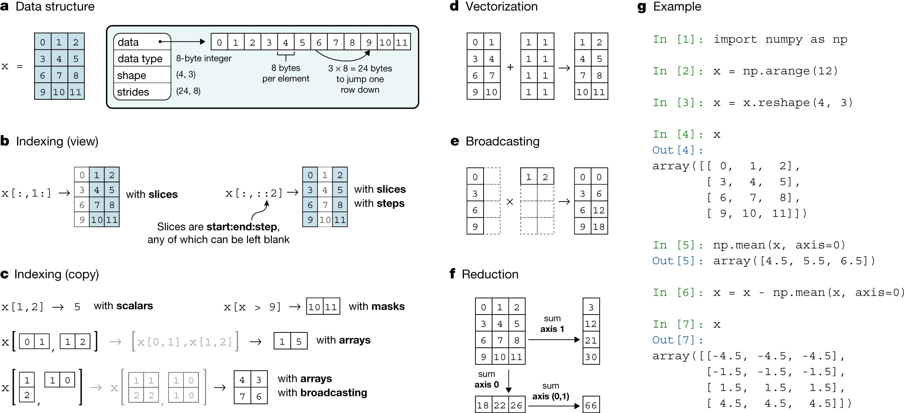

Python 数据科学生态
-----------------

### 数据科学编程语言

在 :numref:`popular-python` 提到，Python 是数据科学领域最受欢迎的编程语言之一，主要因其开源免费的特性、简洁易懂的语法和丰富的科学计算库。同样是面向数据科学的编程语言，R、Scala、MATLAB、Mathematica 的流行度和影响力远不及 Python。

* R 语言主要用于统计分析和可视化，也是一门开源的编程语言。R 语言社区提供了大量的统计和可视化的包，使得它在统计学、经济学、管理学等方向上被广泛使用。然而，R 的语法和数据结构相比 Python 更具有挑战性，对初学者不太友好。R 语言上目前没有可以与 Python 社区中的 PyTorch 、TensorFlow 竞争的包，其对深度学习支持不及 Python。

* Apache Spark 是当前大数据处理的标准，主要基于 Java 虚拟机语言 Scala。尽管 Spark 提供了 PySpark、Spark SQL 等接口，但处理一些精细化的数据处理和分析应用仍需使用 Scala 语言。Scala 对于绝大多数程序员来说，学习难度陡峭。此外，Java 虚拟机对深度学习硬件支持有限。

* MATLAB 是一款经典的数值计算语言，广泛应用于工程和科学研究领域。MATLAB 提供了丰富的工具箱，如信号处理、图像处理、机器学习等。然而，MATLAB 是商业软件，需要购买许可证，且许可证的售价不菲，只有少数的科研机构和企业才能支付许可证费用，这在一定程度上限制了 MATLAB 的大规模使用。与 MATLAB 类似，专注数值和符号计算的 Mathematica 也并未像 Python 这样流行。

### Python 数据科学生态

#### NumPy

NumPy 可用于处理多维数组的数值计算，它底层是一个多维数组 `ndarray`。基于 `ndarray`，用户可以进行数学、线性代数、傅里叶变换等科学计算。NumPy 是整个 Python 科学计算社区的基石，如 SciPy、 pandas、Matplotlib 等库均基于 NumPy 的功能构建。NumPy 提供的功能与 MATLAB 提供的数组和矩阵操作非常相似，因此 NumPy 经常被认为是付费的 MATLAB 的开源替代。 :numref:`numpy-overview` 展示了 NumPy 的 `ndarray` 数据结构和主要 API。

:width:`800px`
:label:`numpy-overview`

NumPy 的 `ndarray` 是基于内存的，其底层主要使用 C 语言实现，面向 CPU（Central Processing Unit，中央处理器） 进行了深度优化。一些复杂的运算（如矩阵乘法、快速傅里叶变换等）则使用了优秀的底层计算库，例如 OpenBLAS。总体上讲，相对其他竞品，NumPy 拥有不错的性能。

NumPy 对现代科学计算产生了深远影响。2020年 发表在 Nature 上的一篇文章 :cite:`harris2020array` 对 NumPy 进行了总结，以 NumPy 为基础的软件栈支持了引力波的发现和黑洞的第一次成像。

而随着大数据、机器学习和人工智能的飞速发展，NumPy 这种面向单机 CPU 和内存的架构逐渐无法应对数据和计算的需求。一方面，大数据已无法存放在单台计算节点的内存中；另一方面，深度学习依赖 GPU（Graphics Processing Unit，图形处理器）等加速器。NumPy 是单机内存计算引擎，无法分布到多台节点，也无法直接运行在各类深度学习加速器上。

但由于 NumPy 的 API 易用且流行，近年来 Python 社区涌现的一系列新应用均模仿了 NumPy。例如，深度学习框架 TensorFlow、PyTorch、Apache MXNet 均提供了类似 NumPy 的多维数组计算接口；JAX 和 CuPy 提供了与 NumPy 几乎一致的 API，并可运行在 GPU 或 Google 的 TPU（Tensor Processing Unit，张量处理器）；SciPy 和 PyData/Sparse 提供了稀疏版本的 NumPy 多维数组功能；分布式计算框架 Dask 和 Xorbits 可以将 NumPy 扩展到多台节点。

#### pandas

pandas 是 Python 社区中的高性能数据分析库。pandas 的名字来源于 "Panel Data" 和 "Python Data Analysis"，即对面板数据进行数据分析。

pandas 的核心的数据结构是 `DataFrame` 。 `DataFrame` 是一个二维的、类似于 Excel 的数据结构，`DataFrame` 有很多列，每一列有该列的属性定义和数据类型；`DataFrame` 有很多行，每行是一条数据。用户使用 pandas 可以进行几乎所有基于 Excel 和 SQL 的数据分析和操作。相比 Excel，panads 能够处理的数据更大，可编程能力更强，可与其他 Python 库紧密结合。相比 SQL，pandas 的语法更灵活丰富。pandas 结合 Jupyter Notebook，可允许用户对数据边探索边分析，这又被称为探索性数据分析（Exploratory data analysis, EDA）。

与 NumPy 类似，pandas 也是单机内存计算引擎，而且受限于全局解释器锁，处理大规模数据时会遇到瓶颈。

#### scikit-learn、XGBoost 与 LightGBM

scikit-learn 支持包括分类、回归、聚类和降维等在内的大多数机器学习任务，包含了许多知名的机器学习算法的实现，如线性回归、支持向量机、随机森林、梯度提升、k-近邻等。scikit-learn 提供了一套统一的接口，使得切换不同的算法非常方便。此外，scikit-learn 还提供了一些用于数据预处理、模型选择和评估的工具，如归一化、交叉验证等。

XGBoost 是决策树机器学习库，与之类似的库还有 LightGBM。XGBoost 和 LightGBM 都是基于决策树模型，在很多问题上的准确性优于神经网络，且拥有很强的可解释性。

#### PyTorch 与 TensorFlow 

PyTorch 和 TensorFlow 是近年来非常火热的深度学习库。尽管 PyTorch 和 TensorFlow 等深度学习库的底层都基于 C++ 语言实现，但对于用户来说，只需要调用 Python 接口，完成神经网络训练或者推理任务。Python 的易用性使得神经网络的开发、实验、部署等各个流程的速度获得极大提升。

#### Dask、Ray 与 Xorbits

原生的 Python 在分布式计算上捉襟见肘。

随着 Dask 、Ray 和 Xorbits 等库的成熟，一些原本需要使用 Scala 编写的 Spark 任务，未来将逐渐迁移到更加 Python 原生的库上。Dask 、Ray 和 Xorbits 提供的功能稍有区别，它们可以从不同维度上将 Python 任务横向扩展到多节点，实现并行计算。